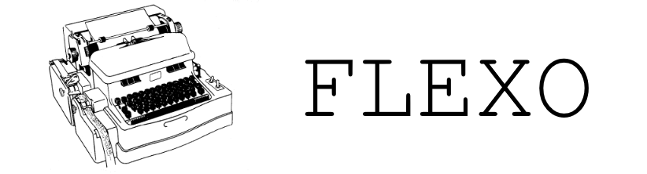

# Flexo
 Flexowriter - the text editor that didn't
 
 Back before there was Notepad, or Nano, or Vi, or Emacs, or TECO, or even the Teletypes model 35/33/28, there was...
  
 THE FLEXOWRITER.
 
 
 
 Manufactured by IBM, then CCC, then Friden, the Singer, the Flexowriter was among the first "programmable" automatic typewriters - being designed to accelerate secretarial work by typing documents read from paper tape or punched cards. By using multiple tape readers, one could even do a fully mechanical mail merge - with one looped tape containing the form letter itself, and another tape (or set of tapes, or stack of punched cards) containing names, addresses, etc.
 
 The optional ["Selectadata"](https://archive.org/details/bitsavers_fridenFridre_2269022/page/n1/mode/1up?view=theater) accessory even permitted a form of mechanical grep - you would dial in a sequence of characters or control codes, and the tape reader would automatically scan the tape for that sequence. Pretty neat stuff for the 1950s!
 
 
 Notably, Flexowriters were also capable of being used as Teleprinters, and many found their way into service as terminal interfaces for early computers - the Harvard Mark I and PDP-1, for instance. Ultimately, Flexowriters were displaced by cheaper, faster Teletypes, and the Glass Terminals that followed largely emulated the Teletype's style of text entry. There's a reason why terminals are still called 'TTY' in *nix, Windows, VMS, etc...
 
 This project is something of an odd experiment. It seeks to create a text editor which follows more in the Flexowriter's style than the Teletype's, replete with "tapes", "code selectors", "tab stops", etc. (Yes, I know the teletype had a tape reader - the Flexowriter was a bit funkier, though.)
 
 It shall be written in Lua - because I said so.
 
 Currently, all that exists of Flexo is this README file. Design docs will start going in /doc, and following that, Flexo itself shall be born. Stay tuned...
